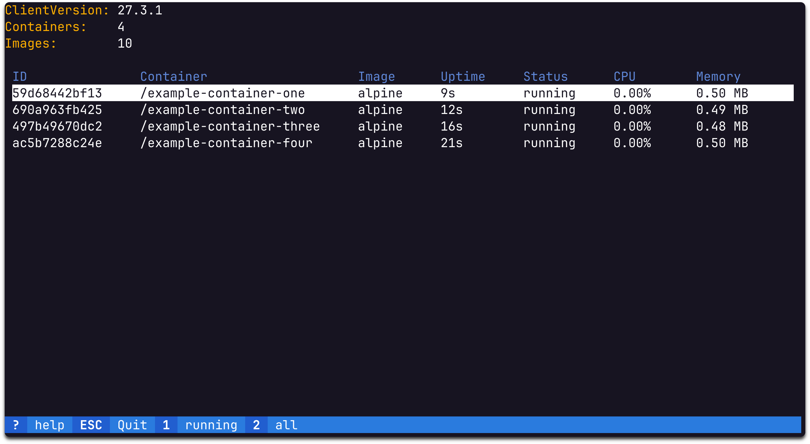

# Gocker - A TUI Tool for Docker Management



## 🙏 Acknowledgments

Heavily inspired by [k9s](https://github.com/derailed/k9s).

## 📦 Installation

**Gocker** supports the following platforms:  
- **Operating Systems**: Linux, macOS, and Windows  
- **Architectures**: amd64, arm64, and 386  

> [!NOTE]
> Testing has primarily been conducted on **Linux (amd64)**.  
> Functionality on macOS and Windows may vary and is not guaranteed.

### Install the Latest Version

To install the latest version of Gocker, run the following command:

```shell
curl https://raw.githubusercontent.com/pommee/gocker/main/installer.sh | sh /dev/stdin
```
This will install the gocker binary specific to your platform.  
The binary is placed in `~/.local/bin`. If the [installer.sh](https://github.com/pommee/gocker/blob/main/installer.sh) script fails, then binaries can be manually downloaded from [releases](https://github.com/pommee/gocker/releases). 

## 🛠 Usage

### Starting the Application
To launch the application, simply run the following command in your terminal:
```console
$ gocker
```

### Available Commands

**Update**  
To check for updates and apply them:

```console
$ gocker update
```

**Info**  
To display version and build information:

```console
$ gocker info
```

**Help**  
For detailed help about commands:

```console
$ gocker help
```
